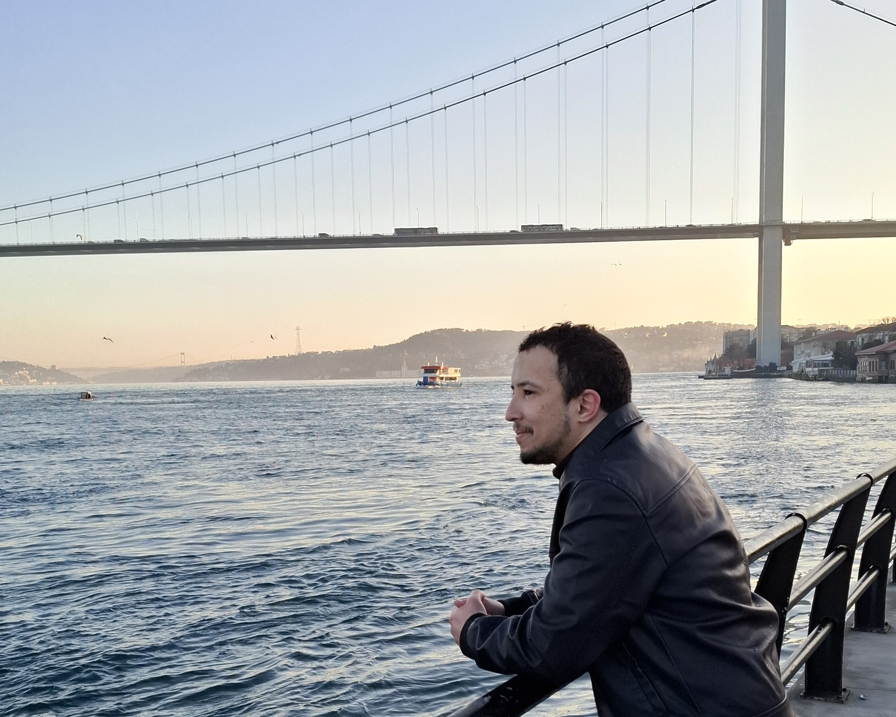

<section id="introduction">
## Who I am

Hi, I'm Mohamed. I'm a frontend developer from Morocco, currently studying Software Engineering in Türkiye.

My relationship with computers started long before I knew what programming was.

Back in 2011, my father came back from a holiday and brought a computer home. At that time, having a computer at home wasn't something very common where I grew up, so I was fascinated by it. But I wasn't interested in software yet. I wanted to know what was **inside** the computer.

I used to open it, look at the parts, collect whatever pieces I could find, and try to fix things that weren't working. Sometimes I probably had no idea what I was doing, but that never stopped me from opening the computer again. For a long time, hardware was my thing.

</section>

<section id="discovering-programming">
## Then I discovered programming

In Morocco, we didn't really have programming classes in school before high school. My first real chance to learn something about programming came in my first year of high school.

We started with Scratch.

It was a very simple way to learn programming. Instead of writing lots of code, we had these blocks that we could put together to make something happen. And I loved it. There is one small memory from that time that I still remember.

One day, our teacher asked:

> Does anyone know which language Android was built with?

I said:

> Java.

I was probably the only person in the class who had an answer. The funny part is that I wasn't even sure. Around that time, when I restarted my phone, I used to see the word **Java**, during the startup. So when the teacher asked the question, I thought, _well... I've seen Java on my phone, so it must be Java._

She was happy, clapped, and said a few nice things.

And honestly, for a few minutes, I thought I was a genius.

Looking back, it was a very small thing. But moments like that made programming feel interesting to me. I started paying more attention to software, and before I finished high school, I had already decided that I wanted to become a software engineer.

</section>

<section id="frontend">
## Starting with the frontend

After high school, I decided to start with frontend development. My first serious learning came from [**Elzero Web School**](https://elzero.org/), where I learned **HTML**, **CSS**, and **JavaScript**. HTML was fine, but CSS was where things started getting difficult. As a beginner, I struggled to make things look the way I wanted. I would change one thing, and suddenly something else would move somewhere it shouldn't. And then there was JavaScript, which was even more challenging.

But I was lucky to learn from someone who explained things really well. He had a way of making difficult topics easy to understand, and the exercises and challenges pushed me to practice what I was learning instead of just watching the lessons.

I really want to say thank you to him here.

I don't want to forget the people who helped me get started. His explanations made a big difference in how I learned, and the exercises he gave us pushed me to keep practicing. Even now, when I think about where I started with frontend development, I still remember how much Elzero Web School helped me.

So, thank you.

</section>

<section id="first-client">
## My first client was a little unusual

After studying for a while, I started looking for ways to actually use what I was learning. My first client came through social media. He had a business helping students with university applications, but his website was old and needed some work. At the same time, I needed help with my own university admission.

So we made a deal.

He would help me with my university admission, and I would work on his website. That became my first client. Not exactly the kind of first-client story you see in a business book, but it worked.

Since then, I've built many different projects, especially **e-commerce websites**, **landing pages**, and **dashboards**. E-commerce became especially interesting to me because I started looking beyond just the page the user sees. I wanted to understand what was happening behind it, how the different parts connected, how the products and data moved around, and how everything worked together. The more I worked on these projects, the more I wanted to understand what was happening beyond the frontend.

</section>

<section id="software-engineering">
## Why I chose Software Engineering

After about a year of studying frontend development and freelancing, I decided to join university and study Software Engineering. It wasn't really a difficult decision. This was something I had wanted to do for a long time, and I wanted to study it properly. and I'm still learning, of course. Probably more than ever.

</section>

<section id="software-values">
## What matters to me when I build software

One thing I care about more and more is **maintainability**. I don't want to build something that only makes sense to the person who wrote it. If another developer opens the project later, I want them to be able to understand what is going on. But I think about the client too. A client shouldn't always need a developer just to change some content, update some data, or make a small change to their website.

If I can build a project in a way that makes those things easier without someone accidentally breaking the whole layout, that's a good result to me. For me, clean code isn't about making the code look clever. It's about making the project easier to understand, change, and live with.

</section>

<section id="community">
## Building a developer community

While studying, I noticed that many students interested in development were learning on their own without really knowing others who shared the same interests. So I decided to create a development community myself; a place where students can connect, learn, and build together. It's still growing, but my goal is to eventually make it one of the biggest developer communities in Türkiye.

That's a big goal, I know. But I'd rather work toward it than decide it's too big.

</section>

<section id="outside-code">
## Outside of code

To be honest, I spend a lot of my time around programming. I enjoy coding, solving problems on [**LeetCode**](https://leetcode.com/), reading, writing, and learning. I also like learning languages, not programming languages this time 😅.

I'm a native **Arabic**, and **Berber**, and I'm fluent **English**. I'm currently learning **Turkish** and **German**.

So apparently, learning how to communicate with computers wasn't enough. Now I'm trying to communicate with more people too.

</section>

<section id="whats-next">
## What's next?

Right now, I'm still learning what it means to become a really good software engineer.

Frontend is where I started, and it is still a big part of what I enjoy, but I don't want my learning to stop there.

In the long run, I want to keep growing the developer community I'm building and make it one of the biggest developer communities in Türkiye. I also want to continue my studies with a Master's degree and get into research in an area related to Software Engineering. And, if I'm being completely honest, I have a very big ambition for the far future.

I want to build something that matters enough for people to remember the person who built it. When we talk about software today, we still remember the names of people who created important technologies, built systems that changed how we work, or solved problems that seemed difficult at the time.

I'd like to leave something behind like that.

I'm nowhere near there yet.

For now, I'm still the guy learning, building projects, solving problems, making mistakes, and opening things up to see how they work.

And I think that's a pretty good place to be.

If you read all the way to the end, thank you 🤝. I know it was a long one, and I really appreciate you taking the time to get to know me.

</section>
